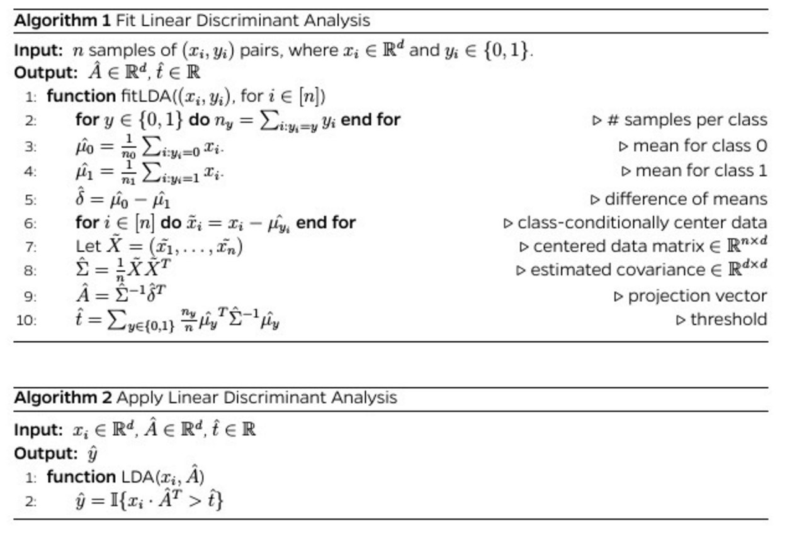
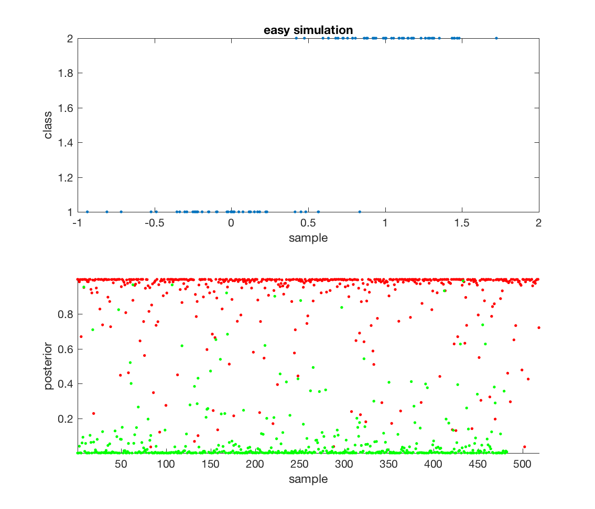
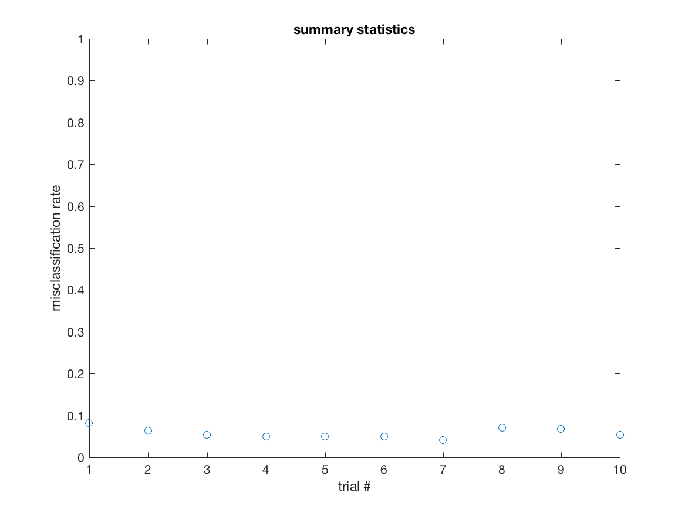
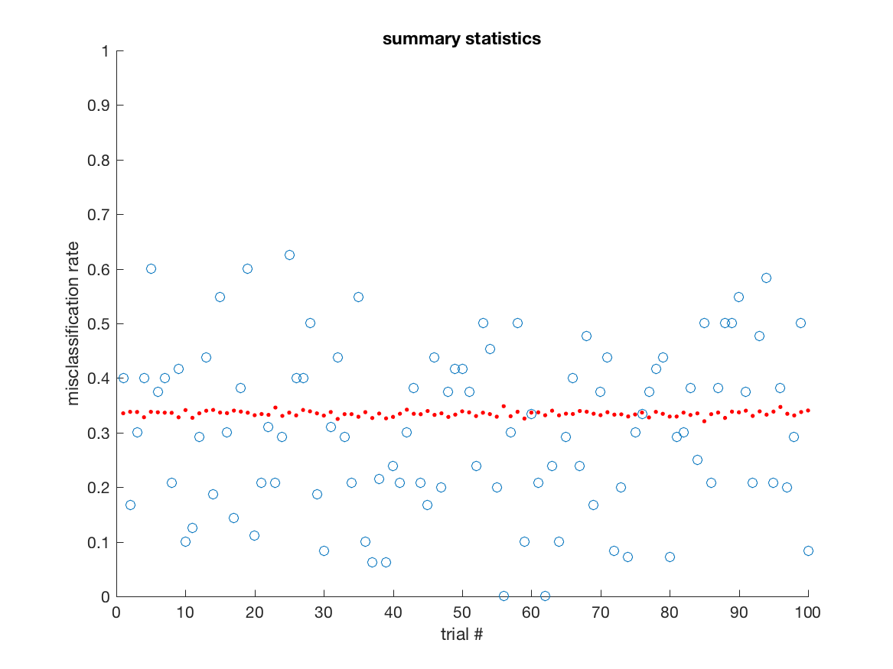

## methods

### setting

1. setting: we are given $n$ samples of pairs $(x_i,y_i)$, $\mathcal{D}_n=\{(x_i,y_i)\}_{i \in [n]}$, where $x_i \in \mathcal{X} \subset \mathbb{R}^d$ and $y_i \in \mathcal{Y} = \{0,1\}$.  and we desire to train a classifier $g_n(x; \mathcal{D}_n): \mathcal{X} \times (\mathcal{X} \times \mathcal{Y})^n \rightarrow \mathcal{Y}$.
2. loss: we evaluate perform via the 0-1 loss, $\delta: \mathcal{X} \times \mathcal{Y} \rightarrow \{0,1\}$, meaning, $\delta(x,y) := \mathbb{I}[g_n(x) \neq y]$.
1. statistical task: learn a classifier that minimizes expected loss, that is:
$$\arg \min_{g_n \in \mathcal{G}_n} \mathbb{E}[\delta(x,y)].$$
1. desiderata: we desire an approach that:
  2. works well in theory on certain settings
  3. empirically performs well on simulations according to those settings
  4. is robust to those assumptions (assuming there are assumptions)
  5. empirically performs well on the real data
  6. is fast enough
  7. is easy to use

### approach

paragraph description of alg: linear discriminant analysis estimates the pooled covariance matrix and the difference of means to learn the vector to projectiont the data on.  if the result is greater than the threshold (which is a function of the priors and means and covariance), it is in class 1, otherwise, class 0.

#### pseudocode

```
\begin{algorithm}
\caption{Fit Linear Discriminant Analysis}
\begin{algorithmic}[1]
\Require $n$ samples of $(x_i,y_i)$ pairs, where $x_i \in \mathbb{R}^d$ and $y_i \in \{0,1\}$.
\Ensure $\hat{A} \in \mathbb{R}^d$, $\hat{t} \in \mathbb{R}$
\Function{fitLDA}{$(x_i,y_i)$, for $i \in [n]$}

\Linefor{$y \in \{0,1\}$}{$n_y = \sum_{i : y_i=y} y_i$}
\Comment{\# samples per class}

\State  $\hat{\mu_0} = \frac{1}{n_0} \sum_{i : y_i=0} x_i$. \Comment{mean for class 0}

\State  $\hat{\mu_1} = \frac{1}{n_1} \sum_{i : y_i=1} x_i$.
\Comment{mean for class 1}

\State $\hat{\delta} = \hat{\mu_0} - \hat{\mu_1}$
\Comment{difference of means}

\Linefor{$i \in [n]$}{$\tilde{x}_i =x_i - \hat{\mu_{y_i}}$} \Comment{class-conditionally center data}

\State Let $\tilde{X} = (\tilde{x_1},\ldots, \tilde{x_n})$ \Comment{centered data matrix  $\in \mathbb{R}^{n \times d}$}

\State $\hat{\Sigma} = \frac{1}{n} \tilde{X} \tilde{X}^T$
\Comment{estimated covariance $\in \mathbb{R}^{d \times d}$}

\State $\hat{A} = \hat{\Sigma}^{-1} \hat{\delta}^T$
\Comment{projection vector}

\State $\hat{t}= \sum_{y \in \{0,1\}} \frac{n_y}{n} \hat{\mu_y}^T \hat{\Sigma}^{-1}\hat{\mu_y}$
\Comment{threshold}
\EndFunction
\end{algorithmic}
\end{algorithm}


\begin{algorithm}
\caption{Apply Linear Discriminant Analysis}
\begin{algorithmic}[1]
\Require $x_i \in \mathbb{R}^d$, $\hat{A} \in \mathbb{R}^d$, $\hat{t} \in \mathbb{R}$
\Ensure $\hat{y}$
\Function{LDA}{$x_i,\hat{A}$}
% \Statex{\textbf{(1)} Calculate all pairwise distances}
% \For{$i,j:=1,\ldots,n$}

\State $\hat{y} = \mathbb{I} \{x_i \cdot \hat{A}^T > \hat{t}\}$
\EndFunction
\end{algorithmic}
\end{algorithm}
```




1. evaluation
  2. on simulated data, we will generate $n_test$ samples and compute average loss over them.
  3. on real data, we will use 10-fold cross-validation


## results

### why would it work well

1. LDA finds the optimal separating hyperplane under the assumption that both classes are sampled from a Gaussian distribution with the same covariance, but have different means.
  1. LDA can get the right answer whenever a hyperplane is optimal. that is, whenever $g^*(x) = x A^T$.
  1. LDA will be asymptotically optimal whenever data from both classes sampled from the same spherically symmetric distributions with different means, in particular, when they are Gaussian with the same covariance matrix.  specifically,
$$ x_i | y_i \sim \mathcal{N}(\mu_{y_i}, \Sigma). $$

1. example for which LDA will do well: $\mu_y = y$, $\sigma^2=0.1$, $n$ is large




2. example for which LDA will not do as well, $\mu_y=y$, $\sigma^2=1+y$, $n$ is large


3. proofs: not necessary for class


### how well does it work

1. same 2 settings as above:




2. simulated numerical extension: not necessary for class

3. training LDA requires $O(n \times d^3)$ time and $d + d^2 + 1$ space.  applying LDA requires $d$ time.

4. real data (only 1 example)

```
load('fisheriris')
y=species;
X=meas;
cp=cvpartition(y,'k',10);
classf = @(XTRAIN, ytrain, XTEST)(classify(XTEST,XTRAIN,ytrain));

tic
cvMCR=crossval('mcr',X,y,'predfun',classf,'partition',cp);
toc
cvMCR =

    0.0200

Elapsed time is 1.272129 seconds.
```

5. synthetic data analysis: not necessary for class


### how well does it do along other desirable dimensions

not necessary for class   
